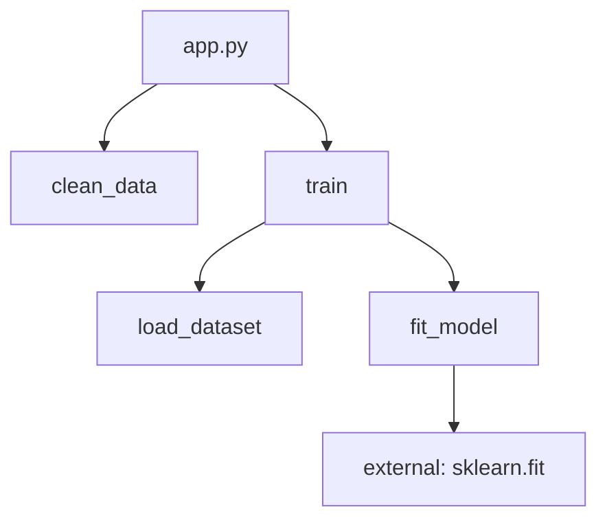

# Flow — see your code as a DAG

Most Python devs understand a project by reading code or a static import graph. `agentx flow`
builds an actual **function-call DAG** instead — either by parsing the file (no execution) or by
running it and recording what really happened. Point it at a directory (or run it with no path at
all) and it builds a whole-**project** graph — packages, modules, classes, and functions —
instead of just one file.

```bash
agentx flow app.py                        # static call graph — no execution, works on any file
agentx flow app.py --entry train_model    # only the subgraph reachable from one function
agentx flow app.py -f mermaid             # paste into a .md file / VS Code / GitHub
agentx flow app.py -f dot > flow.dot && dot -Tsvg flow.dot -o flow.svg
agentx flow                               # whole project (cwd): modules, classes, functions
```



*(illustrative — `agentx flow app.py -f mermaid` generates the real thing from your code)*

## Real execution graph

For the *actual* execution graph — real call counts and per-call timing — decorate functions with
`@trace` and run your code normally, or let the CLI run it for you with `--live` (single file
only):

```python
from agentx.flow import trace

@trace
def clean_data(): ...

@trace
def train(): ...

train()   # each call is recorded — see agentx.flow.get_current_flow()
```

```bash
agentx flow app.py --live   # runs app.py, then renders the REAL execution graph
```

## Interactive 2D/3D viewer

`--ui` skips the text renderers and opens a self-contained, interactive DAG viewer in your
browser — no server, no CDN, works fully offline from one HTML file:

```bash
agentx flow --ui                 # whole project, opens the interactive viewer
agentx flow app.py --ui          # one file
agentx flow --ui --no-open -o flow.html   # write it without launching a browser
```

Nodes are colored by kind (function / class / module / external); a Modules → Classes → Full
detail control collapses large projects down to a coarse module-to-module graph by default; click
a node for its full source and file:line, click two nodes to highlight the call path between
them, search by name, and toggle a secondary experimental 3D view (layered by call depth).
Dark/light follows your system theme with a manual override.

## Type-checking, schemas & live execution (opt-in)

Every node's side panel always shows its declared type-hinted signature and full source, plus a
fields table for classes that look like Pydantic `BaseModel`s — all pure `ast`, no execution, no
new dependency. Two more capabilities are opt-in:

```bash
agentx flow --ui --typecheck        # attach ruff + ty diagnostics to nodes (red badge + list)
agentx flow app.py --serve          # click Run in the browser, watch it execute live
```

- **`--typecheck`** runs [ruff](https://docs.astral.sh/ruff/) (lint) and
  [ty](https://github.com/astral-sh/ty) (Astral's type checker) as subprocesses and maps their
  diagnostics onto the nearest node — an inline red border marks nodes with errors, and the side
  panel lists them (each entry tagged with the tool that flagged it). Requires
  `pip install "agentx-kit[typecheck]"`.
- **`--serve`** (single file only) starts a small local server — click **Run** in the viewer to
  execute the file as a subprocess, with stdout/stderr and per-function call/return events
  streamed live into a log pane and pulsed onto the graph as they happen; **Stop** ends it. A
  command box in the same log pane doubles as a minimal terminal. Requires
  `pip install "agentx-kit[server]"`.

## Edit-in-place

When `--serve` is active, clicking a node shows an **✎ Edit** button next to its source. Clicking
it swaps the read-only view for a live [Monaco](https://microsoft.github.io/monaco-editor/)
editor (the same editor VS Code uses) right there in the side panel:

```bash
agentx flow app.py --serve
```

1. Click a node in the graph.
2. Click **✎ Edit** in the side panel.
3. Edit the function/class body.
4. Click **Save** — it's written straight back to the source file on disk, overwriting *exactly*
   that function or class's lines (computed from the AST's `end_lineno`), nothing else in the
   file is touched.
5. The node gets an **edited** badge — the in-memory graph snapshot is now stale until you reload
   the page (re-run `agentx flow app.py --serve` or refresh the browser tab to see it re-analyzed).

Monaco is only loaded when `--serve` is active, so the offline `--ui` single-file viewer stays a
lightweight, dependency-free document.

!!! warning "This executes/modifies real code on your machine"
    `--serve`'s Run button and edit-in-place both act on your local filesystem. The server binds
    to `127.0.0.1` only and every action requires a random per-session token embedded in the
    page, but there is no sandboxing beyond that — only point `--serve` at code you trust.

## The terminal box

Type any command (e.g. `streamlit run app.py`) and it runs through your OS's own shell, exactly
like typing it in a real terminal (quoting, `&&`, pipes all work; a mistyped or missing command
just prints its own "not found" error like a real shell would — it can't crash the server). The
one exception: if it's exactly `python <file>.py` and that file is part of a package, it's routed
through the same package-aware path the Run button uses (so relative imports inside it resolve),
gaining trace events too.

Both `--live` and `--serve` run the target file the same *package-aware* way regardless of where
you invoke `agentx flow` from: if the file sits inside a package (its directory has an
`__init__.py`), it's run as that module (like `python -m pkg.module`) rather than as a bare
script, so `from .sibling import x`-style relative imports inside it resolve correctly.

## Other flags

- **`--cdn`** references the 2D/3D graph libraries via CDN `<script src>` tags instead of
  inlining them (~2MB smaller file) — off by default, since the point of `--ui` is a single file
  that still works from a plain `file://` URL with no network access.
- Large or accidental directories are guarded with **`--max-files`** (default `20000`).

## Library API

| Building block | What it does |
|---|---|
| `build_static_flow(path, entry=None)` | Parse one file with `ast`, build a function-call graph (best-effort, like `code2flow`/`pyan`) |
| `build_project_flow(root, entry=None)` | Parse every file under a directory, resolving cross-file calls through each file's imports |
| `trace` / `get_current_flow()` | Decorate functions to record real call order, counts, and timing (async-safe) |
| `render_ascii` / `render_mermaid` / `render_json` / `render_dot` | One shape, four text export formats |
| `register_renderer(name, fn)` / `get_renderer(name)` / `available_renderers()` | Renderer plugin registry — `agentx flow -f <name>` dispatches through it |
| `render_html` | The interactive 2D/3D viewer (`--ui`), with optional `diagnostics`/`serve`/`cdn` params |
| `agentx.flow.typecheck.run_typecheck` | ruff + ty wrapper behind `--typecheck` |
| `agentx.flow.server.build_app` | The local FastAPI app behind `--serve` (including the `/api/save` edit-in-place endpoint) |

Try it: `python examples/flow_demo.py`. Full CLI flag reference: [`agentx flow`](../cli/flow.md).
